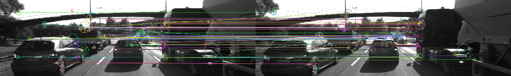

# descriptor_matching_comparion

A series of different descriptor matching and selection methods were tested.

The brute-force matching results were improved by adding bi-directional cross checking of matches.

A FLANN method was also implemented.

